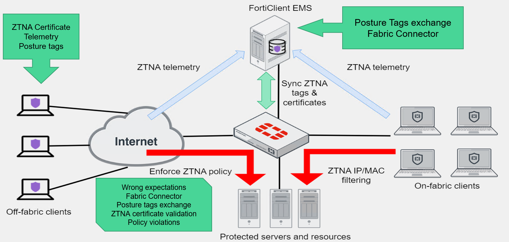
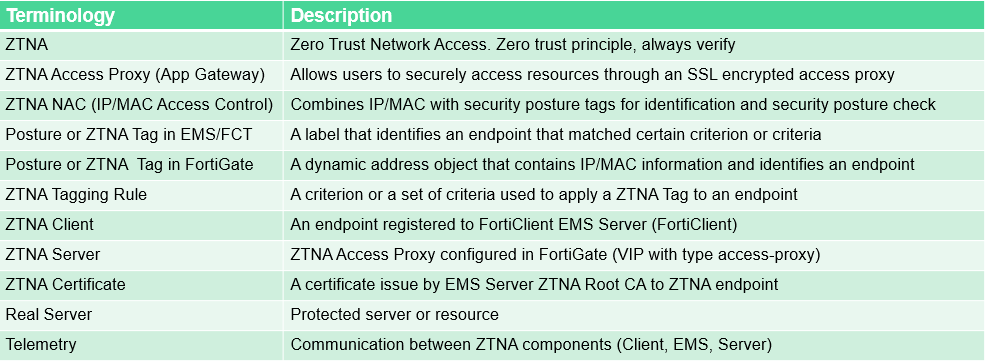

These documents assume solid foundation in understanding of ZTNA and IP/MAC Access Control mechanics acquired from resources like NSE training.
Note, moving forward “ZTNA” term may refer to both ZTNA and IP/MAC Access Control. The document’s content will make it clear what technology is being referred to or explicitly mention which one is being conversed.

## ZTNA troubleshooting map

This is not a complete list of issues that can occur with individual components though covers most of them.

!!! warning "Note!"
    Subject to change due to possible modifications/updates in newer versions.

## Common ZTNA terminology

Note, moving forward “ZTNA” term may refer to both ZTNA and IP/MAC Access Control. The document’s content will make it clear what technology is being referred to or explicitly mention which one is being conversed.

!!! warning "Note!"
    Subject to change due to possible modifications/updates in newer versions.

