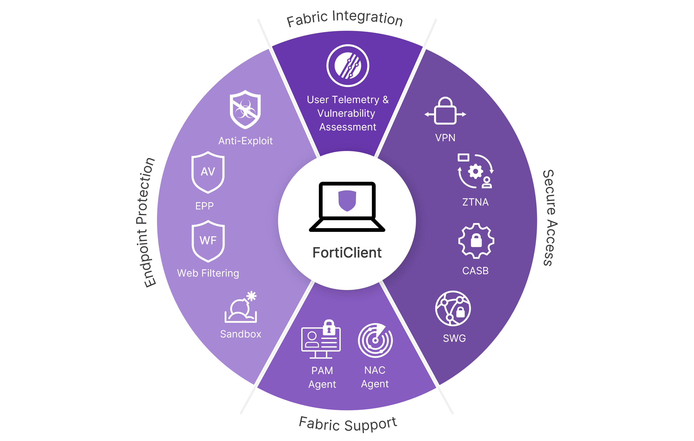

# FortiClient

This section of the program covers FortiClient, its features, issues, and ways to address them.

Fortinet official FortiClient [documentation](https://docs.fortinet.com/product/forticlient/7.4).

## FortiClient VPN Document Cards

- :fontawesome-regular-user: Check out <a href="VPN">__FortiClient VPN__</a>!
- :fontawesome-regular-building: <a href="ZTNA">__ZTNA__</a> section has something for you! 

