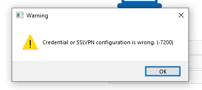
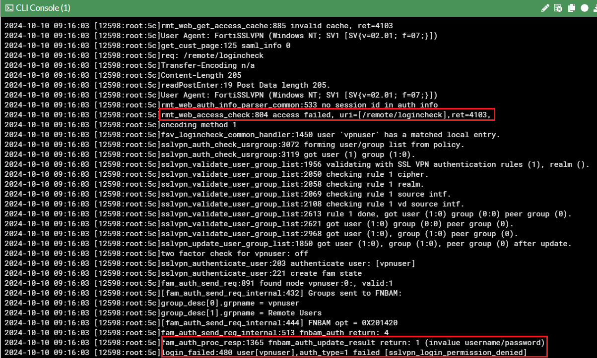

# Initial Connection Issues

Most common causes for initial connection issues are either network- or authentication-related. Below is an approach one can follow to effectively identify and address the root cause for initial VPN connection failures.

## Step 0 - Thoroughly understand what the issue is.

Step 0 is critical and serve as a foundation for each troubleshooting approach described in this doc. However, it won’t be explicitly mentioned going forward. 
Thoroughly understand what the issue is by asking questions, requesting configuration files, diagnostics, screenshots, etc. 

## Step 1 - Pay attention to error codes and connection progress.

Common ones here are 7200 - misconfiguration or credential error and 6005 - destination unreachable. Lack of any error codes or a connection percent count at failure can tell something as well. For instance, failure within 40-50% range is most likely caused by authentication issues. Failure at around 98% most likely points to network issues either on endpoint or network in-between endpoint and VPN server.




## Step 2 - Check logs.

Client side logs:

**Windows**: */Users/username/AppData/Roaming/FortiClient/logs/trace* on the local machine or *general > current_user_logs > trace* in Diagnostic_Result.zip file

**macOS**: */Users/username/Library/Application Support/Fortinet/FortiClient/Logs* locally or VPN logs in FortiClient log export

**FortiGate** side: (VPN events)

## Step 3 - Run FortiGate CLI diagnostics for in-depth troubleshooting.

If FortiClient logs alone don’t help, an engineer may need to retrieve additional data using FortiGate CLI diagnostic commands. Common commands one may find useful for VPN troubleshooting:

```
diag debug reset
diag debug console timestamp enable
diag vpn ssl debug-filter src-addr4 X.X.X.X. (public address of the endpoint)
diag debug app sslvpn -1
diag debug enable
```



Depending on a given case some commands can be added, removed, or modified:
- For SAML authentication troubleshooting ```diag debug app samld -1``` can be added
- For general authentication issues ```diag debug app fnbamd -1``` can be included

## Extras

Common issues that one may come across in the logs particularly in Windows environments:

### Broken Pipes

Named Windows pipes are used by FortiClient to connect applications like sslvpn, fortitray, gui together so they can “chain” their inputs and outputs to complete VPN connection. In essence, pipe is a file that FortiClient’s processes create and write data to as well as read data from. Common pipe errors indicate that FortiClient either fails to write to a pipe or read from it which may result in initial connection failure.

### Windows API Errors

When going through initial VPN connection workflow, FortiClient commands Microsoft API to send HTTPS requests to FortiGate in a form of API calls (/remote/info, /remote/saml/login, /remote/logincheck, etc.). You can spot these errors in the sslvpn logs following an API call. Example below:

***[sslvpnlib 2717 error] Request /remote/saml/login failed. LastError:12152***

Searching these error codes on the Internet should give you a good understanding where to look next.

### Environment

Always keep an eye on the environment a given machine is in. Specifically, network environment outside of (ISP, proxies, firewalls, etc.) and within workstation (NIC, connection type (wired, wireless), drivers, security programs). The environment can play a critical role in contributing to VPN issues.

Tools that may help in troubleshooting:
- sniffer to identify network issues: Wireshark on endpoint, ```diagnose sniffer packet``` CLI suite on FortiGate
- FortiGate VPN tunnel web mode for authentication verification (allows to eliminate FortiClient from the equation and verify whether authentication fails via web browser).
