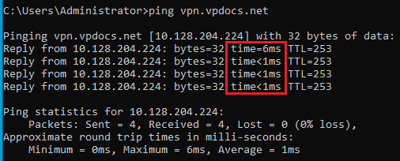
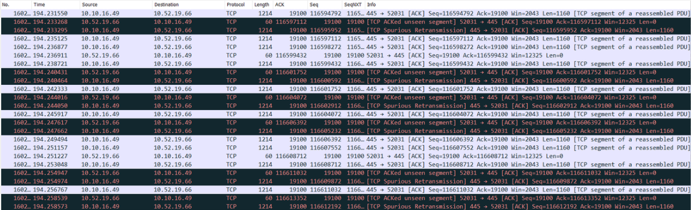

# VPN Performance Issues

Performance issues most commonly are associated with SSLVPN due to its design and frequently caused by network conditions FortiClient is a subject to. This article suggests a step-by-step approach in understanding and addressing VPN perormance issues.

## Step 1 - Understand customer expectations.

Most often customers express their expectations regarding FortiClient VPN performance in relative speed i.e. 600 Mb over 1 Gig link. Use this knowledge as a starting point in troubleshooting.

## Step 2 - Verify network conditions.

Check for network latency by pinging VPN gateway from the host.

Identify packet loss towards VPN gateway by running sniffers on both workstation (1) and firewall (2) (sometimes, running a sniffer on an endpoint may be enough to spot a packet loss, watch for retransmissions in case of regular SSLVPN).
{ .annotate }

1. Wireshark is a great choice here!
2. Community forum document for FortiGate [sniffer](https://community.fortinet.com/t5/FortiGate/Troubleshooting-Tip-Using-the-FortiOS-built-in-packet-sniffer/ta-p/194222)

## Step 3 – Compare the results to industry standards.

Compare collected latency and packet loss data against industry standards. See Fortinet [documentation](https://docs.fortinet.com/document/fortisase/latest/administration-guide/466329/appendix-d-vpn-performance).

## Step 4 - Communicate your results.

Communicate your results to a customer and set proper expectations regarding FortiClient VPN performance given evaluated network conditions.

## Step 5 – Advise on possible improvements.

Advise on improvements (if any). For instance, if SSLVPN is used, one may suggest using DTLS or switching to IPSec.

!!! abstract "SSLVPN to IPsec Migration"
    Overtime, SSLVPN will be deprecated, hence, transition to IPSec VPN is highly encouraged. You can get familiar with offical Fortinet documentation about this migration. See [SSL VPN to IPsec VPN Migration](https://docs.fortinet.com/document/fortigate/7.6.0/ssl-vpn-to-ipsec-vpn-migration/126460/introduction).

## Extras

### Comparing speed test results on/off VPN.

When performing such comparison, start with FC connected to VPN. Take a note of the speed test server selected by the speed test provider with VPN ON. Disconnect VPN and run a speed test against the same speed test server. It'll make sure the path towards the server is similar so the speed test results can be compared.

### Evaluate endpoint software posture.

Check for 3d party security programs (EDR, AV, WF, proxies, etc.) and system drivers installed on workstation. These programs have a potential for affecting FortiClient VPN performance by blocking, analyzing, proxying outbound VPN traffic or interfering with FortiClient processes or drivers. A list of Windows system drivers can be found in FortiClient diagnostics or collected via **`msinfo32 /nfo C:\TEMP\TEST.NFO`** command on Windows. For macOS, check system extensions by running **`systemextensionsct list`** command.

## Demo

Below demo will focus on comparing speed test results ON and OFF VPN.
