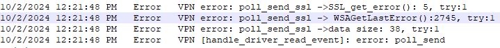
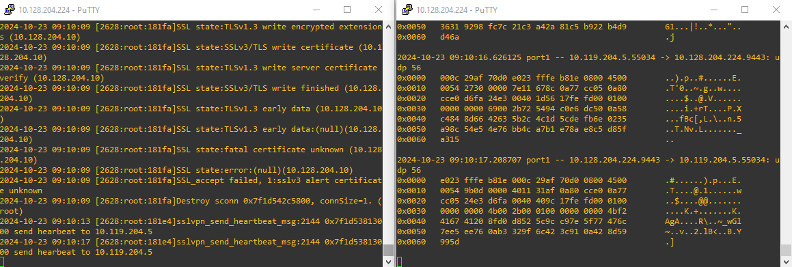
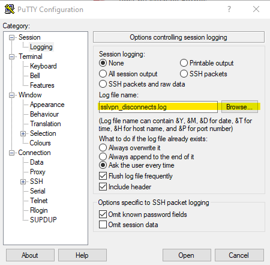

# VPN Disconnects

VPN disconnects are often random and unpredictable which makes it hard to troubleshoot at times unless a systematic approach is followed. 

## Step 1 – Start with logs.

Client side logs

**Windows**: *C:\Program Files\Fortinet\FortiClient\logs\trace\sslvpndaemon_* locally on workstation or general\logs\trace\sslvpndaemon_ in Diagnostic_Result.zip

**macOS**: */Users/username/Library/Application Support/Fortinet/FortiClient/Logs\vpn-provider.log* or within the log export (FortiClient > Settings > Export Logs)

**FortiGate** side logs - search for VPN disconnection logs under VPN Events.

## Step 2 – Identify disconnect event.

Identify disconnect event by searching for keywords. Common ones are ***error***, ***disconnect***, ***terminated***, etc. In case of DTLS, also check for timeout errors - ***error: DTLS polling recv timeout***. When using IPsec with DPD, look for dead peer logs. It’s always a good idea to check with a customer regarding time of when the issue occurred.

See examples below:

**(FortiClient) IPSec DPD logs**


**(FortiGate) IPSec DPD logs**


FortiGate CLI commands providing output like the one above:

```
diag debug reset
diag debug console timestamp enable
diag vpn ike filter src-addr4 X.X.X.X. (public address of the endpoint)
diag debug app ike -1
diag debug enable
```

**(FortiClient) DTLS timeout**


## Step 3 - Apply acquired knowledge towards problem resolution.

Often VPN disconnects are caused by network issues either within computer itself (driver or NIC issues, application errors, security program blocks, etc.) or outside - ISP, firewall issues.

It’s quite common to see Windows socket errors causing VPN drop so getting familiar with [Windows socket errors](https://learn.microsoft.com/en-us/windows/win32/winsock/windows-sockets-error-codes-2) will be helpful. Note, sometimes they might be represented in hexadecimal form like ***WSAGetLastError():2745*** which should be converted to decimal and then looked up on the Microsoft website.



Make sure to carefully examine software installed on workstation. Specifically, check for 3d party security software (common offenders are EDR, AV, WF, proxy security programs).

- ***Allproducts.xml*** file part of every FortiClient's diagnostics contains a list of installed applications (Diagnostic_Result.zip\FCDiagData\install\Allproducts.xml)
- ***SystemInfo.txt*** included in every diagnostics file shows system information including applications, crashes, drivers, OS details, etc.

Keep an eye on [broken pipes](../init_conn/#broken-pipes) as they can also show up in the logs and cause VPN to disconnect.

## Tools

In cases when disconnects are predictable (i.e. happens within a minute after VPN connection), use sniffers on both endpoint and firewall simultaneously to identify if there's any packet loss.

Wireshark is a great choice for running a sniffer on endpoint. FortiGate has GUI packet capture tool as well as ```diagnose sniffer packet``` CLI utility.

Below is an example of having SSLVPN diagnostics (left) running simaltaneously with packet capture (right).



In the above example the following commands were executed:


```
diagnose debug application sslvpn -1
diagnose vpn ssl debug-filter src-addr4 X.X.X.X
diagnose debug enable
```

```
diag sniffer packet ssl.root "host X.X.X.X and port 9443" 6 0 l
```
... where "X.X.X.X" is a public IP of the endpoint.

Note **6 0 l** at the end of the sniffer command. This switch will allow to convert the sniffer CLI output into .pcap format for use in Wireshark.

!!! note "Hint"
    When running multiple diagnostic commands on FortiGate simultaneously, use Putty and set it up for sending output to a text file.



The FortiGate output should be compleneted with endpoint-side Wireshark capture. It's advantageous to use Wireshark capture filters (1) as well as Wirshark display filters (2) to only include interesting traffic. 
{ .annotate }

1. Find few examples of Wireshark capture filters [here](https://wiki.wireshark.org/CaptureFilters)
2. Find few examples of Wireshark display filters [here](https://wiki.wireshark.org/DisplayFilters)

 

## Extras

Use **```sent/recvd```** counters in FortiClient sslvpndaemon to identify network timeouts.

For example in case of DTLS, it gets timed out after around 10 seconds if not receiving any traffic on FortiClient’s vNIC adapter. The 10-second interval of lack of any data on SSLVPN interface can be tracked within the same **sslvpndaemon_x.log** log by looking at recvd counters:

**bytes sent:29025412 bytes recvd:227333471 [handle_ssl_sock_recv_event]**

Find an entry similar to the one above and go up the log checking whether the recvd counter remains the same for 10 seconds – indication of no data received on the virtual interface causing disconnect.

## Demos

Below demos walk through routine VPN disconnect scenarios suggesting a troubleshooting approach that one can follow to address them.

### SSLVPN DTLS Disconnects

DTLS is being adopted by customers to address peformance issues SSLVPN is prone to. Unfortunately, it isn't immune from disconnects. We'll walk through a DTLS disonnection case in the following demo.

<div style="max-width: 640px"><div style="position: relative; padding-bottom: 56.25%; height: 0; overflow: hidden;"><iframe src="https://fortinet-my.sharepoint.com/personal/vpolovnikov_fortinet-us_com/_layouts/15/embed.aspx?UniqueId=1f2fe1d6-a0b3-462a-8e6f-0f05d3ef9366&embed=%7B%22ust%22%3Atrue%2C%22hv%22%3A%22CopyEmbedCode%22%7D&referrer=StreamWebApp&referrerScenario=EmbedDialog.Create" width="640" height="360" frameborder="0" scrolling="no" allowfullscreen title="Demos-20241028_101203-Meeting Recording.mp4" style="border:none; position: absolute; top: 0; left: 0; right: 0; bottom: 0; height: 100%; max-width: 100%;"></iframe></div></div>

### IPSec Disconnects

Same as DTLS, IPSec contains a KA mechanism that can tear the tunnel down if no traffic is detected over the tunnel - DPD or Dead Pear Detection. This demo demonstrates IPSec VPN disconnection scenario with DPD enabled.

<div style="max-width: 640px"><div style="position: relative; padding-bottom: 56.25%; height: 0; overflow: hidden;"><iframe src="https://fortinet-my.sharepoint.com/personal/vpolovnikov_fortinet-us_com/_layouts/15/embed.aspx?UniqueId=e65ed63b-d54a-4815-a337-8cb1480c0487&embed=%7B%22ust%22%3Atrue%2C%22hv%22%3A%22CopyEmbedCode%22%7D&referrer=StreamWebApp&referrerScenario=EmbedDialog.Create" width="640" height="360" frameborder="0" scrolling="no" allowfullscreen title="Demos-20241028_105110-Meeting Recording.mp4" style="border:none; position: absolute; top: 0; left: 0; right: 0; bottom: 0; height: 100%; max-width: 100%;"></iframe></div></div>